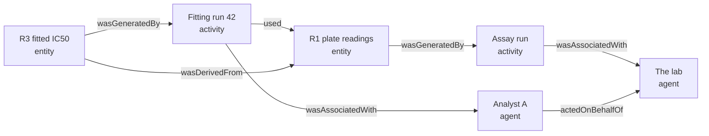

# Session 1 Handout: Warrant, Grounds, and Provenance

*AI Computed Provenance Community Group · Meeting of 2026-09-24*

This handout summarizes the concepts from the R2 Primer that today's session discusses. It is a
companion to the primer, not a replacement for it. Section numbers in brackets, such as [R2 §4],
point to the primer.

## 1. Key ideas

### Standing is computed, not asserted [R2 §3]

A claim's standing is computed from the evidence recorded for it. It is never asserted by the
party that produced the claim. No producer writes "verified": a reader holding the record
computes the claim's standing, and every reader holding the same record computes the same
standing. This is what the group's slogan "Computed ≠ Asserted" means.

### Proofs and records of grounds [R2 §4]

Recorded evidence is of two kinds, and the format keeps them apart.

|                                        | Proof                                      | Record of grounds                                           |
| -------------------------------------- | ------------------------------------------ | ----------------------------------------------------------- |
| Establishes                            | the statement itself                       | what the claim rests on                                     |
| If it checks, the statement holds      | yes                                        | no                                                          |
| Another party reaches the same verdict | yes, given a checker for its logic         | only by accepting the same premises                         |
| Typical sources                        | proof assistants; the format's own checker | instruments, datasets, analysis software, AI models, people |

Most scientific evidence is a record of grounds, and that is not a weakness. The danger is
software that turns "these are the grounds for P" into "P is proved". The specification must
make that substitution impossible to express.

### Provenance and warrant [R2 §5]

|            | Provenance                                                   | Warrant                                             |
| ---------- | ------------------------------------------------------------ | --------------------------------------------------- |
| Question   | How did this come to exist?                                  | What evidence supports what it states?              |
| Applies to | every resource                                               | only resources that state something                 |
| Example    | produced by run 17 of pipeline P, from dataset D, on 3 March | rests on an observation and a declaration by Dr. S |

The two are independent. A hand-typed claim with a proof that checks is verified. An
AI-generated claim with no proof is not. The format maps provenance onto W3C PROV (see section
2), and warrant is the part this group defines.

### The three grounds [R2 §6]

| Ground       | What it establishes                                                               | What a reader must accept to rely on it                            |
| ------------ | --------------------------------------------------------------------------------- | ------------------------------------------------------------------ |
| **Verified** | the statement itself, by a proof that checks                                      | the checker, and for a proof from another system, the translation |
| **Observed** | that a recording occurred: this instrument, sample, and protocol gave this output | that the recording is faithful; a wider claim needs a further premise |
| **Declared** | that a named, accountable party asserted the statement                            | trust in that party                                                |

Each ground establishes something narrower than the claim it supports. Hence the format's main
rule: **record only what was actually established.** Where a conclusion goes further than its
evidence, the step between them is recorded as a premise declared by a named party.

"Declared" is attribution, not a judgement of quality. The format does not rate sources. It says
whom a claim relies on, and leaves the decision to rely on them to the reader.

### How grounds combine [R2 §7]

A justification is a structure, not a single label. The most common combination is a plan
applied to an input. A curve fit applied to measured data rests on two grounds: a declaration
that the plan is a function of its input, and the observation of the input.

- Whether the software actually ran is provenance, not evidence. If the plan is a function, the
  result follows from the input whether or not anyone ran it.
- Such a result is not verified, because someone declared the plan a function and nobody proved
  it.
- Where the process is stochastic, no such declaration can be made. The output is a sample: this
  run produced this output.

### Warrant is computed, not stored [R2 §8]

- A "verified" label with no proof behind it cannot be written down in this format.
- If a declaration is withdrawn, every conclusion resting on it loses that support without being
  edited. The earlier state of the record remains citable.
- Support must not be circular: a claim cannot support itself, directly or through other claims.

### AI model outputs are observations [R2 §10]

A call to a generative model is recorded the same way as a laboratory assay: as an observation
of what one run produced. "Temperature zero with a fixed seed" is an assertion by whoever
configured the run, not something a configuration file proves. One evaluation run supports "the
reranker improves accuracy" no better than one animal supports "the drug is effective".

## 2. W3C PROV in brief

PROV is the W3C standard for recording where data came from and how it was produced, published
on 30 April 2013. Four of its documents are W3C Recommendations: PROV-DM (the data model), PROV-O
(the model as an OWL ontology for RDF), PROV-N (a readable notation), and PROV-CONSTRAINTS (rules
for a valid history). The [PROV Primer](https://www.w3.org/TR/prov-primer/) is the best place to
start.

PROV describes history with three kinds of node.

| Concept  | What it is                                                                   | In the worked example          |
| -------- | ---------------------------------------------------------------------------- | ------------------------------ |
| Entity   | a physical, digital, or conceptual thing whose history is described          | plate readings R1; fitted IC50 R3 |
| Activity | something that happens over time, using and generating entities              | the assay run; fitting run 42  |
| Agent    | something that bears responsibility: a person, an organization, or software | the lab; analyst A; scientist S |

The main relations:

| Relation          | Connects             | Example                                       |
| ----------------- | -------------------- | --------------------------------------------- |
| wasGeneratedBy    | entity to activity   | R3 was generated by fitting run 42            |
| used              | activity to entity   | Fitting run 42 used R1                        |
| wasDerivedFrom    | entity to entity     | R3 was derived from R1                        |
| wasAttributedTo   | entity to agent      | R4 was attributed to scientist S              |
| wasAssociatedWith | activity to agent    | Fitting run 42 was associated with analyst A  |
| actedOnBehalfOf   | agent to agent       | Analyst A acted on behalf of the lab          |
| wasInformedBy     | activity to activity | Fitting run 42 was informed by the assay run  |

A **Plan** is the procedure an agent followed, such as an assay protocol. A **Bundle** groups
provenance statements so that the provenance of a provenance record can itself be described.



The diagram shows the provenance of R3 from the worked example: who ran what, on which inputs.

**Where PROV stops.** PROV treats what an entity says as opaque. It can record that R3 was
derived from R1 by a run analyst A was responsible for. It cannot record what R3 states, whether
that follows from R1, or that a claim holds only if you accept someone's bridging premise.
Validity in PROV-CONSTRAINTS means the history is consistent, not that a claim is supported.
That gap is what warrant fills.

## 3. Worked example: an enzyme inhibition claim [R2 §9]

A research group, assisted by an automated pipeline, wants to record this claim:

> **C:** Compound K inhibits enzyme E with an IC50 below 10 µM.

The pipeline records five items.

| Item | Content                                                                                                               | Justification            |
| ---- | --------------------------------------------------------------------------------------------------------------------- | ------------------------ |
| R1   | Plate-reader outputs: 8 concentrations, 3 replicates each, under assay protocol P                                     | Observed                 |
| R2   | Analysis plan: a four-parameter logistic fit with a 95% confidence interval; and the plan is a function of its input | Declared, by analyst A   |
| R3   | Fitted IC50 for R1 is 3.2 µM, with a 95% confidence interval of 2.1–4.8 µM                                            | R2 applied to R1         |
| R4   | Bridge: if this assay's fitted IC50 has an upper bound below 10 µM, then K inhibits E below 10 µM                     | Declared, by scientist S |
| C    | The claim                                                                                                             | R4 applied to R3         |

The justification for C, in informal notation:

```
C  rests on  apply( declared(R4, by S),
                   apply( declared(R2 is a function of its input, by A),
                          observed(R1) ) )
```

The provenance of these items, shown in the PROV diagram above, is recorded separately. None of
it appears in the justification.

**Try it yourself.** Answer these from the record alone, as a reviewer with no access to the lab
or the pipeline would. We will compare answers in the session.

1. Is C verified?
2. Whom does C rely on, and for what?
3. What would re-running the analysis establish?
4. What happens to C, and to R3, if scientist S withdraws R4?
5. What would have to change for R3 to become verified?

## 4. Questions for discussion

**Scope**

- What does "computed" mean in "Computed ≠ Asserted"?
- Which of your own use cases fit "one producer, one context"? Which need records from several
  parties combined?

**Proofs and grounds**

- Is a p-value below 0.05 a proof of the effect? Of anything?
- Do you use a system that blurs the two, such as a "verified" badge or a green check?

**Provenance and warrant**

- Does a vocabulary term have a warrant?
- PROV has `wasAttributedTo`. Is that enough to express "C rests on scientist S's premise"? What
  is missing?
- Should the format map its provenance records onto PROV-O, or use PROV-O's identifiers
  directly?

**AI model outputs**

- Is a model output at temperature zero with a fixed seed an observation or a computation?
- In your own work, where does a single model run stand in for a general claim?

**The primer itself**

- Where did the primer lose you, or tell you what you already knew?
- Do "warrant", "grounds", and "standing" work for the people you would show this to?
- Could you contribute a second worked example from your own field?

## 5. What the first specification does not yet guarantee [R2 §14]

The first specification covers one producer working in one context, and states where its
guarantees stop.

- **Translation between reasoning systems.** It records which translation related two
  statements, but does not yet establish that the translated statement means the same as the
  original.
- **Transport between contexts.** A proof in the format's own logic can be re-checked anywhere. A
  record of grounds cannot; a reader elsewhere must examine its premises afresh.
- **Changes of vocabulary.** A statement is checked against the vocabulary in force where it was
  written. Whether it keeps its meaning after that vocabulary changes is not yet established.
- **Combining records.** Merging work from several parties is planned for a later phase.

## 6. Glossary

| Term              | Meaning                                                                                                                     |
| ----------------- | --------------------------------------------------------------------------------------------------------------------------- |
| Application       | Grounds combined as a plan, declared to be a function, applied to an input. The result rests on both.                      |
| Declared          | The ground recording that a named, accountable party asserted a statement.                                                 |
| Judgement         | A checked statement that a term has a given type in a named logic. When the type is a proposition, it is a verified proof. |
| Justification     | The structure recording what a claim rests on and how its grounds combine.                                                 |
| Observed          | The ground recording that a recording occurred: an instrument reading, a sample, a model output.                           |
| Proof             | Evidence that establishes a statement and that anyone with a checker can re-check.                                         |
| Provenance        | The record of how a resource came to exist. Maps onto W3C PROV.                                                            |
| Record of grounds | Evidence that records what a claim rests on without establishing the claim.                                                |
| Standing          | What a claim's evidence amounts to, computed from its justification.                                                       |
| Verified          | The ground recording that a proof of the statement itself has been checked.                                                |
| Warrant           | The standing of a claim that states a proposition. Never stored and never asserted.                                        |

## 7. Reading and feedback

- [R2 Primer](../../charter/r2-non-normative-report.md), the full version of everything above.
- [Charter draft](../../charter/charter.md), especially "Computed and asserted" and "Provenance
  and warrant".
- [PROV Overview](https://www.w3.org/TR/prov-overview/) and
  [PROV Primer](https://www.w3.org/TR/prov-primer/), W3C, 30 April 2013.
- [Tiinex continuity observations](tiinex-practical-continuity-observations-v0.1.md), to be
  discussed at a later session with its author.

Please give feedback on the primer as issues in the group's GitHub repository.
